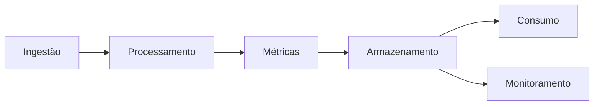
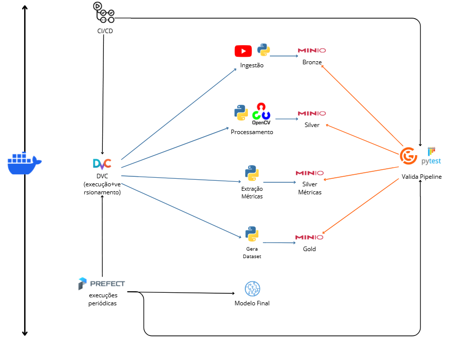

# Pipeline de Engenharia de Dados para Detecção de Vídeos Gerados por IA

---

# Descrição do Projeto

## Nome do projeto e contexto

Este projeto propõe o desenvolvimento de um pipeline de engenharia de dados para suportar a detecção de vídeos gerados por inteligência artificial (deepfakes). O aumento da produção de conteúdo sintético tem gerado desafios relacionados à autenticidade de mídia, segurança digital e disseminação de desinformação.

## Problema e objetivos

Atualmente, os dados utilizados no projeto apresentam limitações importantes:

- Armazenamento não estruturado
- Ausência de versionamento de dados
- Falta de automação no pipeline
- Baixa reprodutibilidade
- Ausência de monitoramento e validação de dados

### Objetivos principais:

- Automatizar a ingestão incremental de vídeos
- Estruturar um Data Lake com arquitetura em camadas
- Padronizar o processamento de vídeos e extração de métricas
- Garantir reprodutibilidade com versionamento de dados
- Implementar validação contínua de dados
- Disponibilizar datasets confiáveis para Machine Learning

---

# Definição e Classificação dos Dados

## Classificação dos dados

### Dados operacionais (Batch)

- Vídeos (.mp4)
- Metadados (.json, .csv)
- Métricas (.parquet)

**Características:**

- Processamento offline
- Alto volume de dados
- Reprocessáveis

### Dados de streaming

- Logs de execução do pipeline
- Eventos de execução (ex: início/fim de tarefas)

**Características:**

- Baixa latência
- Uso para monitoramento

## Detalhamento das fontes

| Fonte     | Origem         | Formato   | Periodicidade | Latência |
| --------- | -------------- | --------- | ------------- | --------- |
| Vídeos   | YouTube        | MP4       | Incremental   | Alta      |
| Metadados | Scripts Python | JSON/CSV  | Batch         | Média    |
| Métricas | OpenCV         | Parquet   | Batch         | Alta      |
| Logs      | Prefect/Docker | JSON/Text | Contínuo     | Baixa     |

---

# Domínios e Serviços

## Domínios

### 1. Ingestão de Dados

- Download de vídeos
- Geração de metadados

### 2. Processamento de Vídeo

- Padronização de vídeos
- Extração de frames
- Segmentação de regiões

### 3. Extração de Métricas

- Cálculo de features (LBP, FFT, Sobel)

### 4. Armazenamento e Governança

- Organização em Data Lake
- Versionamento de dados

### 5. Consumo de Dados

- Dataset final para ML
- Análise exploratória

### 6. Monitoramento e Qualidade

- Validação de dados
- Logs e execução

## Diagrama de domínios

---

# Arquitetura — O que será feito (Fluxo de Dados)

## Fluxo ponta a ponta

## Integração das tecnologias

* Prefect agenda execução do pipeline e validação
* DVC reprodiz o pipeline e versiona os dados
* MinIO armazena os dados em camadas para cada etapa
* CI/CD valida o pipeline e versiona o codigo
* Great Expectations e Pytest garante qualidade dos dados durante a validação

---

## Caminhos batch e streaming

### Batch (principal)

* Ingestão de vídeos
* Processamento
* Extração de métricas
* Construção do dataset

### Streaming (secundário)

* Logs de execução
* Eventos do pipeline

---

## Tipo de arquitetura

Arquitetura adotada: **Lakehouse com padrão Medalhão**

* **Bronze:** dados brutos
* **Silver:** dados processados
* **Gold:** dados prontos para consumo

### Justificativa

* Separação clara de camadas
* Facilita reprocessamento
* Reduz acoplamento
* Eficiênte para pipelines de Machine Learning

## Trade-offs

### Vantagens

* Alta reprodutibilidade com DVC
* Escalabilidade com MinIO
* Organização clara dos dados
* Monitoramento contínuo

### Desvantagens

* Processamento batch (alta latência)
* Alto custo computacional
* Execução local limitada

---

# Tecnologias — Como será feito

## Ingestão

* Python (yt-dlp)

> Solução simples e eficiente para coleta de vídeos, integrada ao pipeline existente.

## Armazenamento

* MinIO (Data Lake S3-like)

> * Armazenamento escalável
> * Compatível com ferramentas modernas
> * Ideal para arquivos grandes

## Processamento e transformação

* Python (OpenCV, pandas, numpy)
* Parquet para dados estruturados

> * Alto desempenho
> * Integração com pipeline existente
> * Eficiência na leitura/escrita

## Orquestração

* Prefect

> * Agenda execuções periódicas
> * Orquestra o pipeline completo
> * Executa o comando `dvc repro`
> * Executa os testes do pipeline

## Versionamento e execução do pipeline

* DVC

> * Define o pipeline de dados
> * Executa etapas de forma incremental
> * Versiona datasets
> * Garante reprodutibilidade

## CI/CD

* GitHub Actions

> * Executa pipeline com dvc
> * Valida código e dados para garantir que não terá quebra na produção
> * Versiona o código

## Monitoramento e qualidade de dados

* Great Expectations
* Logging (Python)
* Pytest
* Prefect logs

> * Validação contínua dos dados
> * Detecção de inconsistências
> * Aumento da confiabilidade

## Consumo de dados

* Jupyter Notebook para experimentação
* Modelagem final
* Metabase

> * Análise exploratória
> * Visualização de dados
> * Criação de modelos com reprodutibilidade

---

# Considerações Finais

## Riscos e limitações

* Crescimento do volume de dados
* Alto consumo de CPU
* Dependência de qualidade dos dados de entrada
* Limitações de execução local

## Referências

* [Documentação oficial do MinIO](https://docs.min.io/enterprise/aistor-object-store/)
* [Documentação do Prefect](https://docs.prefect.io/v3/get-started)
* [Documentação do DVC](https://doc.dvc.org)
* [Documentação do GitHub Actions](https://docs.github.com/pt/actions)
* [Documentação do Great Expectations](https://docs.greatexpectations.io/docs/home/)
* [Documentação Pytest](https://docs-pytest-org.translate.goog/en/stable/?_x_tr_sl=en&_x_tr_tl=pt&_x_tr_hl=pt&_x_tr_pto=tc)
