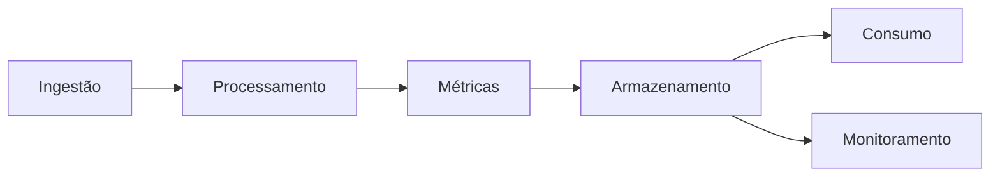
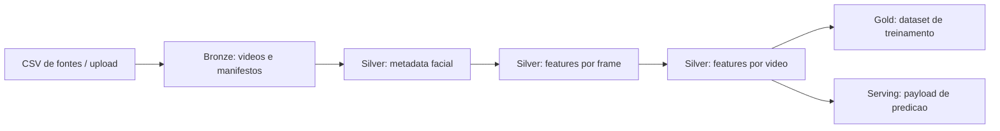

# Pipeline de Engenharia de Dados para Detecção de Vídeos Gerados por IA

---

# Descrição do Projeto

## Nome do projeto e contexto

Este projeto propõe o desenvolvimento de um pipeline de engenharia de dados para suportar a detecção de vídeos gerados por inteligência artificial (deepfakes). O aumento da produção de conteúdo sintético tem gerado desafios relacionados à autenticidade de mídia, segurança digital e disseminação de desinformação.

## Problema e objetivos

Atualmente, os dados utilizados no projeto apresentam limitações importantes:

- Armazenamento não estruturado
- Ausência de versionamento de dados
- Falta de automação no pipeline
- Baixa reprodutibilidade
- Ausência de monitoramento e validação de dados

### Objetivos principais:

- Automatizar a ingestão incremental de vídeos
- Estruturar um Data Lake com arquitetura em camadas
- Padronizar o processamento de vídeos e extração de métricas
- Garantir reprodutibilidade com versionamento de dados
- Implementar validação contínua de dados
- Disponibilizar datasets confiáveis para Machine Learning

---

# Definição e Classificação dos Dados

## Classificação dos dados

### Dados operacionais (Batch)

- Vídeos (.mp4)
- Metadados (.json, .csv)
- Métricas (.parquet)

**Características:**

- Processamento offline
- Alto volume de dados
- Reprocessáveis

### Dados de streaming

- Logs de execução do pipeline
- Eventos de execução (ex: início/fim de tarefas)

**Características:**

- Baixa latência
- Uso para monitoramento

## Detalhamento das fontes

| Fonte     | Origem         | Formato   | Periodicidade | Latência |
| --------- | -------------- | --------- | ------------- | --------- |
| Vídeos   | YouTube        | MP4       | Incremental   | Alta      |
| Metadados | Scripts Python | JSON/CSV  | Batch         | Média    |
| Métricas | OpenCV         | Parquet   | Batch         | Alta      |
| Logs      | Prefect/Docker | JSON/Text | Contínuo     | Baixa     |

---

# Domínios e Serviços

## Domínios

### 1. Ingestão de Dados

- Download de vídeos
- Geração de metadados

### 2. Processamento de Vídeo

- Padronização de vídeos
- Extração de frames
- Segmentação de regiões

### 3. Extração de Métricas

- Cálculo de features (LBP, FFT, Sobel)

### 4. Armazenamento e Governança

- Organização em Data Lake
- Versionamento de dados

### 5. Consumo de Dados

- Dataset final para ML
- Análise exploratória

### 6. Monitoramento e Qualidade

- Validação de dados
- Logs e execução

## Diagrama de domínios



---

# Arquitetura — O que será feito (Fluxo de Dados)

## Fluxo ponta a ponta



## Integração das tecnologias

* Prefect agenda execução do pipeline e validação
* DVC reprodiz o pipeline e versiona os dados
* MinIO armazena os dados em camadas para cada etapa
* CI/CD valida o pipeline e versiona o codigo
* Great Expectations e Pytest garante qualidade dos dados durante a validação

---

## Caminhos batch e streaming

### Batch (principal)

* Ingestão de vídeos
* Processamento
* Extração de métricas
* Construção do dataset

### Streaming (secundário)

* Logs de execução
* Eventos do pipeline

---

## Tipo de arquitetura

Arquitetura adotada: **Lakehouse com padrão Medalhão**

* **Bronze:** dados brutos
* **Silver:** dados processados
* **Gold:** dados prontos para consumo

### Justificativa

* Separação clara de camadas
* Facilita reprocessamento
* Reduz acoplamento
* Eficiênte para pipelines de Machine Learning

## Trade-offs

### Vantagens

* Alta reprodutibilidade com DVC
* Escalabilidade com MinIO
* Organização clara dos dados
* Monitoramento contínuo

### Desvantagens

* Processamento batch (alta latência)
* Alto custo computacional
* Execução local limitada

---

# Tecnologias — Como será feito

## Ingestão

* Python (yt-dlp)

> Solução simples e eficiente para coleta de vídeos, integrada ao pipeline existente.

## Armazenamento

* MinIO (Data Lake S3-like)

> * Armazenamento escalável
> * Compatível com ferramentas modernas
> * Ideal para arquivos grandes

## Processamento e transformação

* Python (OpenCV, pandas, numpy)
* Parquet para dados estruturados

> * Alto desempenho
> * Integração com pipeline existente
> * Eficiência na leitura/escrita

## Orquestração

* Prefect

> * Agenda execuções periódicas
> * Orquestra o pipeline completo
> * Executa o comando `dvc repro`
> * Executa os testes do pipeline

## Versionamento e execução do pipeline

* DVC

> * Define o pipeline de dados
> * Executa etapas de forma incremental
> * Versiona datasets
> * Garante reprodutibilidade

## CI/CD

* GitHub Actions

> * Executa pipeline com dvc
> * Valida código e dados para garantir que não terá quebra na produção
> * Versiona o código

## Monitoramento e qualidade de dados

* Great Expectations
* Logging (Python)
* Pytest
* Prefect logs

> * Validação contínua dos dados
> * Detecção de inconsistências
> * Aumento da confiabilidade

## Consumo de dados

* Jupyter Notebook para experimentação
* Modelagem final
* Metabase

> * Análise exploratória
> * Visualização de dados
> * Criação de modelos com reprodutibilidade

---

# Considerações Finais

## Riscos e limitações

* Crescimento do volume de dados
* Alto consumo de CPU
* Dependência de qualidade dos dados de entrada

---

# Implementação inicial local

Esta etapa transforma a arquitetura em scripts reaproveitáveis para duas trilhas:

* **trilha de engenharia de dados/treinamento**: processa vários vídeos e cria o dataset Gold local;
* **trilha de produção/backend**: recebe um vídeo, gera metadados, extrai sinais e devolve features prontas para o modelo.

## Camadas locais atuais

* **Bronze local**: `data/bronze/videos/`
* **Manifestos Bronze**: `data/bronze/manifests/`
* **Metadados faciais auxiliares**: `data/silver/face_metadata_json/*_meta.json`
* **Silver local estruturado**: `data/silver/face_metadata/`, `data/silver/frame_features/` e `data/silver/video_features/`
* **Gold local**: `data/gold/gold_training_dataset.parquet` ou `.csv` quando o ambiente ainda não possui engine Parquet
* **Contratos oficiais**: `data/docs/contracts.md`

## Organização atual da pasta `data/`

```text
data/
  README.md
  docs/
    contracts.md
  bronze/
    videos/
    manifests/
      video-metadata-publish-with-links.csv
      bronze_manifest.csv
  silver/
    face_metadata_json/
    face_metadata/
    frame_features/
    video_features/
  gold/
    gold_training_dataset.parquet
```

`face_metadata_json` existe porque o extrator atual ainda consome o JSON com `bbox` e `bbox_expanded`. A saída oficial tabular da camada Silver é `silver/face_metadata`, alinhada ao contrato `frame_metadata`.

## Scripts criados

### Execução reprodutível com DVC e Prefect

O pipeline local foi organizado para ser executado de duas formas:

* **DVC**: executor reprodutível das etapas de dados (`ingest`, `preprocess`, `gold`, `validate`) via `dvc.yaml`.
* **Prefect**: orquestrador periódico futuro, chamando `dvc repro` e coletando logs/relatórios.

O ponto de entrada comum é:

```bash
python -m src.data_engineering.pipeline <comando>
```

Exemplo local ponta a ponta:

```bash
python -m src.data_engineering.pipeline build --groups abcde --generate-missing-metadata
```

Exemplo da trilha final planejada:

```bash
dvc repro
```

Em produção, um flow Prefect deve agendar `dvc repro`, monitorar falhas e publicar o relatório de `data/reports/pipeline_latest.json`.

O passo a passo local para MinIO como remote DVC está em `docs/minio_dvc_local.md`.

### Ingestão YouTube para Bronze

```bash
python -m src.data_engineering.ingestion "https://www.youtube.com/watch?v=..."
```

Também aceita arquivo de links:

```bash
python -m src.data_engineering.ingestion --links-file links.txt --label Fake
```

Para executar a ingestao a partir de um CSV com links:

```bash
python -m src.data_engineering.ingestion --source-csv data/bronze/manifests/video-metadata-publish-with-links.csv --url-column Media --label-column "Video Ground Truth"
```

O script baixa vídeos com `yt-dlp` em `data/bronze/videos/` e registra `data/bronze/manifests/bronze_manifest.csv`, seguindo o contrato `bronze_manifest`.

### Pré-processamento facial

```bash
python -m src.data_engineering.preprocessing --video data/bronze/videos/exemplo.mp4
```

Gera `data/silver/face_metadata_json/exemplo_meta.json` com `frame_id`, `bbox`, `bbox_expanded`, `source` e `detector_score`.

Tambem materializa a metadata tabular em `data/silver/face_metadata/`, seguindo o contrato `frame_metadata`.

### Pipeline de produção para um vídeo

```bash
python -m src.api data/bronze/videos/exemplo.mp4 --groups abcde --json
```

Esta é a base para o backend da aplicação final. O fluxo executado é:

```text
video -> metadata facial -> features frame-level A-E -> features video-level -> entrada do modelo
```

### Dataset Gold local para treinamento

```bash
python -m src.data_engineering.datasets --groups abcde --generate-missing-metadata
```

O script lê `data/bronze/manifests/video-metadata-publish-with-links.csv`, procura vídeos em `data/bronze/videos/`, garante metadados quando solicitado e cria uma tabela Gold com uma linha por vídeo.

Ele tambem materializa `data/silver/video_features/`, separando o ativo Silver tecnico do `gold_training_dataset`.

## Módulos reutilizáveis

* `src/shared/video.py`: leitura amostrada de frames, bbox, regiões e metadata.
* `src/shared/features/group_a.py`: LBP, Sobel e Laplacian.
* `src/shared/features/group_b.py`: SIFT e Patch Similarity.
* `src/shared/features/group_c.py`: ruído residual.
* `src/shared/features/group_d.py`: FFT.
* `src/shared/features/group_e.py`: física de iluminação.
* `src/shared/features/extractor.py`: orquestra A-E e agrega features video-level.
* `src/data_engineering/preprocessing/metadata.py`: extração de metadados faciais.
* `src/data_engineering/datasets/gold.py`: trilha batch para Silver video features e Gold.
* `src/api/services/video_analysis.py`: trilha de produção para um vídeo individual.

## Observação para produção

O modelo final deve consumir as features geradas por `src.shared.features.extractor.build_video_features`. Essa função é o ponto de reaproveitamento entre treinamento e inferência, evitando divergência entre o dataset Gold e o backend da aplicação.

## Preparação para arquitetura madura

O monorepo deve evoluir mantendo fronteiras claras:

* `src.data_engineering.pipeline`: comandos executáveis por CLI, DVC e Prefect.
* `src.data_engineering.ingestion`: ingestão Bronze.
* `src.data_engineering.preprocessing`: metadata facial Silver.
* `src.data_engineering.datasets`: construção Silver/Gold para treinamento.
* `src.shared.contracts`: contratos e validação de integridade.
* `src.shared.storage`: fronteira local/MinIO.
* `src.shared.features`: sinais A-E reaproveitados por treino e API.
* `src.ml`: domínio futuro de treino, avaliação e registry de modelos.
* `src.api`: trilha de produção para um vídeo individual.
* `tests/`: testes Pytest de contratos, splits e integridade dos ativos.

O armazenamento local em `data/` representa os buckets futuros do MinIO:

```text
data/bronze   -> bucket/prefix bronze
data/silver   -> bucket/prefix silver
data/gold     -> bucket/prefix gold
data/reports  -> bucket/prefix reports
```

Essa decisão permite apresentar o MVP local no TCC sem bloquear a migração para MinIO, CI com Pytest, API SaaS e execução periódica com Prefect.
* Limitações de execução local

## Referências

* [Documentação oficial do MinIO](https://docs.min.io/enterprise/aistor-object-store/)
* [Documentação do Prefect](https://docs.prefect.io/v3/get-started)
* [Documentação do DVC](https://doc.dvc.org)
* [Documentação do GitHub Actions](https://docs.github.com/pt/actions)
* [Documentação do Great Expectations](https://docs.greatexpectations.io/docs/home/)
* [Documentação Pytest](https://docs-pytest-org.translate.goog/en/stable/?_x_tr_sl=en&_x_tr_tl=pt&_x_tr_hl=pt&_x_tr_pto=tc)
