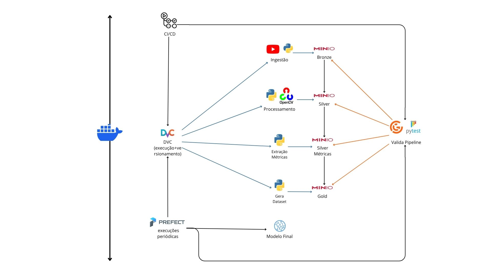
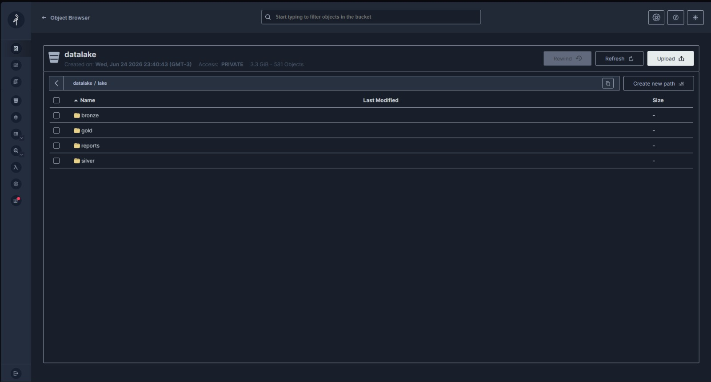

# Pipeline de Engenharia de Dados para Detecção de Vídeos Gerados por IA

Este documento descreve a versão atual e funcional do pipeline de engenharia de dados do projeto. 

## Visão Geral

O objetivo da engenharia de dados aqui é transformar vídeos brutos em um dataset confiável para servir o treinamento e inferência do modelo, mantendo rastreabilidade, validação, reprodutibilidade e organização por camadas.

Fluxo principal:

```text
CSV link,label
-> Bronze: videos e manifesto de ingestão
-> Silver: metadata facial
-> Silver: features por frame
-> Silver: features por vídeo
-> Gold: dataset oficial de treinamento
-> Reports: qualidade, métricas, plots e logs
-> MinIO: cache DVC versionado e lake navegável
```

Arquitetura operacional:



Lake navegável no MinIO:



## Decisão Arquitetural

A arquitetura adotada é uma Lakehouse local com padrão medalhão:

- **Bronze**: entrada bruta e manifesto oficial de ingestão.
- **Silver**: dados processados, metadata facial e features.
- **Gold**: dataset final para treino.
- **Reports**: observabilidade, qualidade e auditoria.

O repositório roda localmente, mas já foi desenhado para evoluir para armazenamento S3-like com MinIO e execução periódica com Prefect.

## Tecnologias

| Tecnologia | Função no projeto |
|---|---|
| Python | Implementação dos pipelines e dos extratores |
| yt-dlp | Download dos vídeos de entrada |
| OpenCV | Leitura de frames e processamento visual |
| MediaPipe | Detecção facial, landmarks de rosto/olhos/boca e segmentação corpo/fundo |
| pandas / pyarrow | Tabelas CSV/Parquet |
| DVC | Execução reprodutível e versionamento de dados |
| MinIO | Storage S3-like local |
| Prefect | Orquestração periódica do pipeline |
| Great Expectations | Validação formal dos contratos |
| Pytest | Testes de integridade |
| Docker Compose | MinIO e ambiente reprodutível do pipeline |

CI/CD está fora do escopo desta etapa, mas a estrutura atual já deixa o projeto pronto para receber GitHub Actions posteriormente.

## Organização Do Repositório

```text
.
├── data/
│   ├── bronze/
│   │   ├── manifests/
│   │   │   ├── video-metadata-publish-with-links.csv
│   │   │   └── bronze_manifest.csv
│   │   └── videos/
│   ├── silver/
│   │   ├── face_metadata_json/
│   │   ├── face_metadata/
│   │   ├── frame_features/
│   │   └── video_features/
│   ├── gold/
│   │   └── gold_training_dataset.parquet
│   └── reports/
│       ├── pipeline_latest.json
│       ├── metrics.json
│       ├── logs/
│       └── plots/
├── docs/
│   ├── README.md
│   ├── contracts.md
│   ├── minio_dvc_local.md
│   └── img/
├── src/
│   ├── shared/
│   ├── data_engineering/
│   ├── ml/
│   └── api/
├── tests/
├── docker-compose.yml
├── Dockerfile
├── dvc.yaml
├── params.yaml
├── requirements.txt
└── .env.example
```

## Contratos De Dados


Contratos atuais:

| Contrato | Camada | Grão | Função |
|---|---|---|---|
| `bronze_source_csv` | Entrada Bronze | uma linha por link | Fonte mínima com `link,label` |
| `bronze_manifest` | Bronze | uma linha por vídeo | Registro oficial de ingestão |
| `frame_metadata` | Silver | uma linha por frame e região | Metadata MediaPipe, região e origem da bbox |
| `frame_features` | Silver | uma linha por frame e região | Sinais A-E por frame e região |
| `video_features` | Silver | uma linha por vídeo e região | Agregações por vídeo/região |
| `gold_training_dataset` | Gold | uma linha por vídeo e região | Dataset pronto para treino e EDA por região |
| `prediction_payload` | Serving | uma resposta por vídeo | Contrato futuro da API |

### CSV De Entrada Bronze

O CSV externo usado para ingestão deve conter apenas:

```csv
link,label
https://www.youtube.com/shorts/4cwcSCQH8HE,false
```

Regras:

- `label=true` vira `Real`;
- `label=false` vira `Fake`;
- o CSV bruto não precisa ter `video_id`, `filename`, hash ou path;
- essas informações são derivadas pela ingestão e registradas no manifesto Bronze.

Arquivo padrão:

```text
data/bronze/manifests/video-metadata-publish-with-links.csv
```

Arquivo de smoke test usado na validação local:

```text
data/bronze/manifests/smoke_source.csv
```

## Camadas Do Pipeline

### Bronze

Responsável por receber links, baixar vídeos e registrar a ingestão.

Entradas:

```text
data/bronze/manifests/video-metadata-publish-with-links.csv
```

ou, para smoke test:

```text
data/bronze/manifests/smoke_source.csv
```

Saídas:

```text
data/bronze/videos/*.mp4
data/bronze/manifests/bronze_manifest.csv
```

O `bronze_manifest.csv` é a fonte de verdade para as etapas seguintes.

Campos principais:

```text
video_id
source_url
filename
storage_path
sha256
downloaded_at
label
status
error_message
source_type
```

Status aceitos:

```text
pending
downloaded
failed
skipped
```

### Silver Metadata

Responsável por abrir os vídeos, detectar faces e salvar a metadata facial por frame.

Saídas:

```text
data/silver/face_metadata_json/{video_id}_meta.json
data/silver/face_metadata/{video_id}.parquet
```

Campos principais:

```text
video_id
frame_id
bbox_x1, bbox_y1, bbox_x2, bbox_y2
bbox_expanded_x1, bbox_expanded_y1, bbox_expanded_x2, bbox_expanded_y2
source
detector_score
frame_width
frame_height
processed_at
pipeline_version
```

O campo `source` explica de onde veio a bbox:

```text
detector
tracker
last_bbox
fallback_center
```

Isso permite medir se o pipeline realmente conseguiu detectar faces ou se usou fallback demais.

### Silver Features

Responsável por extrair os sinais dos grupos A-E.

Saídas:

```text
data/silver/frame_features/{video_id}.parquet
data/silver/video_features/video_features.parquet
```

Grupos atuais:

| Grupo | Tema | Exemplos de sinais |
|---|---|---|
| A | Textura | LBP, Sobel, Laplacian, entropia |
| B | Estrutura | SIFT, patch similarity |
| C | Resíduo bilateral | estatísticas robustas, dependência espacial e correlação cromática |
| D | Frequência espacial | PSD, razões de potência, perfil radial e anisotropia |
| E | Fotometria regional | luminância, crominância, assimetria e candidatos de sombra |

As fórmulas, nomes e limites de interpretação da versão atual estão definidos
em `docs/contrato_sinais_v0_2.md`. Temporalidade e reflexos oculares não
integram esta versão; sombras são tratadas como candidatos fotométricos, sem
validação geométrica 3D.

A extração centralizada fica em:

```text
src/shared/features/extractor.py
```

### Gold

Responsável por gerar o dataset oficial para treinamento.

Saída:

```text
data/gold/gold_training_dataset.parquet
```

Campos de governança:

```text
video_id
target_label
dataset_split
is_trainable
quality_flag
missing_feature_ratio
pipeline_version
```

Critérios mínimos para `is_trainable=True`:

- `target_label` em `Real/Fake`;
- `n_frames > 0`;
- `metadata_rows_used > 0`;
- `missing_feature_ratio` aceitável;
- `quality_flag == ok`.


### Reports

Responsável por auditoria, métricas e validação.

Saídas:

```text
data/reports/pipeline_latest.json
data/reports/metrics.json
data/reports/logs/pipeline_YYYYMMDD.jsonl
data/reports/plots/gold_distributions.csv
data/reports/plots/stage_counts.csv
```

O relatório principal informa:

- quantidade de vídeos no Bronze;
- downloads concluídos;
- falhas;
- cobertura facial;
- fallback ratio;
- features processadas;
- missing feature ratio;
- quantidade de linhas Gold;
- quantidade de linhas treináveis;
- distribuição Real/Fake;
- status dos contratos;
- status do Great Expectations;
- erros bloqueantes.

Exemplo de resultado esperado:

```text
status = passed
blocking_errors = []
contracts = passed
great_expectations = passed
gold.trainable_rows = 1
```

## DVC, MinIO e Lake Navegável

O projeto usa a seguinte estratégia:

```text
pipeline escreve localmente em data/
DVC versiona os outputs locais
dvc push envia o cache versionado para MinIO
publish-lake publica uma cópia navegável por camadas
```

### DVC

O DVC é o executor reprodutível e versionador dos dados.

Arquivos principais:

```text
dvc.yaml
dvc.lock
params.yaml
```

Stages atuais:

```text
ingest_bronze
build_silver_metadata
build_gold_dataset
validate_data_contracts
```

Comando principal:

```bash
dvc repro
```

Isso executa:

```text
Bronze -> Silver metadata -> Silver features/Gold -> validação
```

Depois:

```bash
dvc push
```

O `dvc push` envia os arquivos reais para o MinIO, mas em formato de cache versionado por hash:

```text
s3://<bucket>/dvc/files/md5/...
```

Esse formato não é feito para navegação humana. Ele é feito para reprodutibilidade.

### Utilidade Das Versões De Dados

O DVC permite responder:

- qual versão do Gold treinou determinado modelo;
- quais vídeos entraram nessa versão;
- quais parâmetros foram usados;
- quais hashes representam cada output;
- como restaurar exatamente o mesmo dataset em outra máquina.

Fluxo futuro para treino:

```bash
git pull
dvc pull
python -m src.ml.train
```

O `dvc pull` lê o `dvc.lock` e restaura exatamente os arquivos esperados em `data/`.

### Lake Navegável

O lake navegável é uma cópia legível para humanos e auditoria.

Comandos:

```bash
python -m src.data_engineering.infra publish-lake
python -m src.data_engineering.infra list-lake
```

Estrutura criada no MinIO:

```text
s3://<bucket>/lake/bronze/...
s3://<bucket>/lake/silver/...
s3://<bucket>/lake/gold/...
s3://<bucket>/lake/reports/...
```

## MinIO

O MinIO roda via Docker Compose.

Subir serviço:

```bash
docker compose up -d minio
```

Console:

```text
http://localhost:9001
```

Usuário e senha padrão local:

```text
admin / admin123
```

As variáveis ficam em:

```text
.env
.env.example
```

Exemplo:

```env
MINIO_ROOT_USER=admin
MINIO_ROOT_PASSWORD=admin123
MINIO_ENDPOINT=localhost:9000
MINIO_CONSOLE=http://localhost:9001
MINIO_ACCESS_KEY=admin
MINIO_SECRET_KEY=admin123
MINIO_BUCKET=tcc-datalake
MINIO_DVC_PREFIX=dvc
MINIO_LAKE_PREFIX=lake
MINIO_SECURE=false
DVC_REMOTE_NAME=minio
```

## Prefect

O Prefect é a camada de orquestração periódica.

Hoje o flow executa:

```text
dvc repro
dvc metrics show
dvc push
python -m src.data_engineering.infra publish-lake
python -m src.data_engineering.infra list-lake
```

Execução única:

```bash
python -m src.data_engineering.orchestration.prefect_flow run
```

Execução única sem push:

```bash
python -m src.data_engineering.orchestration.prefect_flow run --no-push
```

Execução agendada local:

```bash
python -m src.data_engineering.orchestration.prefect_flow serve --interval-seconds 86400
```

Ou com cron:

```bash
python -m src.data_engineering.orchestration.prefect_flow serve --cron "0 3 * * *"
```

## Docker

O Docker Compose define dois serviços:

```text
minio
data-pipeline
```

`minio` é o storage S3 local.

`data-pipeline` é um ambiente reprodutível com Python, DVC, dependências do pipeline e acesso ao MinIO.

Build:

```bash
docker compose --profile pipeline build data-pipeline
```

Testes no container:

```bash
docker compose --profile pipeline run --rm data-pipeline python -m pytest tests -q
```

DVC no container:

```bash
docker compose --profile pipeline run --rm data-pipeline dvc repro
docker compose --profile pipeline run --rm data-pipeline dvc push
```

Publicar lake no container:

```bash
docker compose --profile pipeline run --rm data-pipeline \
  python -m src.data_engineering.infra publish-lake
```

Diferença de endpoint:

```text
WSL/host: localhost:9000
container: minio:9000
```

O `docker-compose.yml` já faz esse override no serviço `data-pipeline`.

## Testes E Validações

### Testes Pytest

```bash
python -m pytest tests -q
```

Cobrem:

- contrato do CSV Bronze;
- normalização `true/false -> Real/Fake`;
- leitura do manifesto Bronze para Gold;
- splits Gold reprodutíveis;
- mapeamento do lake MinIO;
- integridade básica do DVC;
- validação de contratos.

### Validação Do Pipeline

```bash
python -m src.data_engineering.pipeline validate \
  --report data/reports/pipeline_latest.json \
  --with-gx \
  --fail-on-error
```

`--fail-on-error` bloqueia a execução quando houver:

- Bronze vazio;
- contratos falhando;
- Silver metadata vazia;
- Silver features vazia;
- Gold vazio;
- Gold sem linhas treináveis;
- `missing_feature_ratio` acima do limite;
- `fallback_center_ratio` acima do limite.

### Métricas E Plots DVC

```bash
dvc metrics show
dvc plots show
```

Arquivos:

```text
data/reports/metrics.json
data/reports/plots/gold_distributions.csv
data/reports/plots/stage_counts.csv
```

## Cold Start Resumido

Partindo de Docker instalado e conectado ao WSL:

```bash
cd /home/guilherme_monteiro/projetos/tcc

cp .env.example .env
docker compose up -d minio

python3 -m venv .venv
source .venv/bin/activate
pip install --upgrade pip
pip install -r requirements.txt

set -a
source .env
set +a

python -m src.data_engineering.infra init
python -m pytest tests -q
dvc repro
dvc metrics show
dvc push
python -m src.data_engineering.infra publish-lake
python -m src.data_engineering.infra list-lake
```

## Smoke Test Com Um Vídeo

Crie ou edite:

```text
data/bronze/manifests/smoke_source.csv
```

Conteúdo:

```csv
link,label
https://www.youtube.com/shorts/4cwcSCQH8HE,false
```

Em `params.yaml`, use:

```yaml
pipeline:
  source_csv: data/bronze/manifests/smoke_source.csv
  manifest: data/bronze/manifests/bronze_manifest.csv
  videos_dir: data/bronze/videos
  metadata_dir: data/silver/face_metadata_json
  groups: abcde
  max_frames:
  detect_every: 1
  face_detector_model: models/face_detector.task
  face_model: experimentos/grupo_b/data/extracted/face_landmarker.task
  segmenter_model: models/image_segmenter.task
  max_faces: 10
  face_detection_confidence: 0.3
  face_landmark_confidence: 0.3
  limit:
  url_column: link
  label_column: label
  generate_missing_metadata: true
  overwrite_metadata: false
```

Execute:

```bash
dvc repro
```

Resultado validado:

```text
Bronze: 1 vídeo baixado
Silver metadata: 194 frames com face
Silver features: 1 vídeo processado
Gold: 1 linha treinável
Contracts: passed
Great Expectations: passed
Pipeline status: passed
```

## Casos De Validação Obrigatórios

Para demonstrar o pipeline completo:

```bash
# 1. Testes unitários/de integração
python -m pytest tests -q

# 2. Pipeline DVC
dvc repro

# 3. Métricas
dvc metrics show

# 4. Push versionado para MinIO
dvc push

# 5. Lake navegável
python -m src.data_engineering.infra publish-lake
python -m src.data_engineering.infra list-lake

# 6. Prefect
python -m src.data_engineering.orchestration.prefect_flow run

# 7. Container
docker compose --profile pipeline build data-pipeline
docker compose --profile pipeline run --rm data-pipeline python -m pytest tests -q
docker compose --profile pipeline run --rm data-pipeline dvc repro
docker compose --profile pipeline run --rm data-pipeline dvc push
```

## Como Limpar Artefatos Locais

Limpar outputs locais sem apagar CSVs de entrada:

```bash
rm -rf data/bronze/videos/*
rm -f data/bronze/manifests/bronze_manifest.csv
rm -rf data/silver/face_metadata_json/*
rm -rf data/silver/face_metadata/*
rm -rf data/silver/frame_features/*
rm -rf data/silver/video_features/*
rm -rf data/gold/*
rm -rf data/reports/*
```

Limpar cache DVC local:

```bash
rm -rf .dvc/cache
```

Limpar MinIO local:

```bash
docker compose down
docker volume ls
docker volume rm tcc_minio_data
```

O nome do volume pode mudar caso `COMPOSE_PROJECT_NAME` tenha sido alterado.
